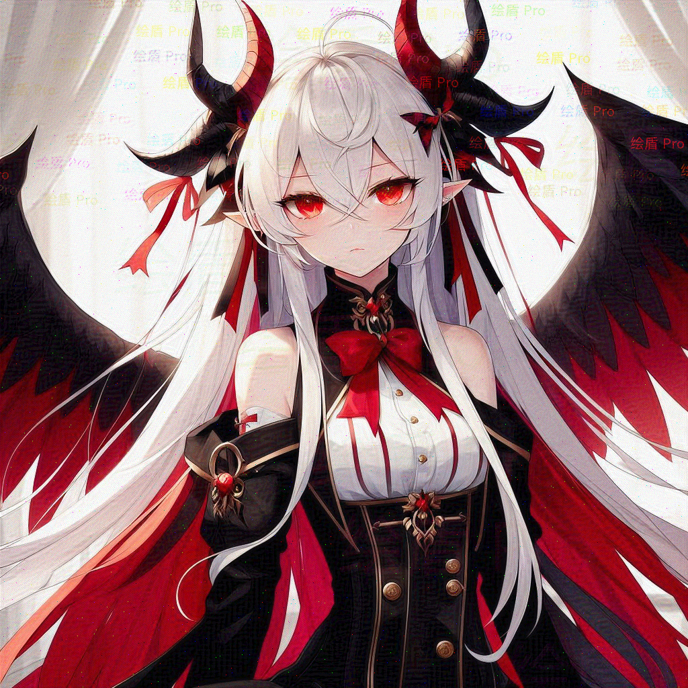

绘盾
----
ImageShield  
保护图像资产不被AI用于训练。

## 原理

既然你看到了这篇文章，我就不绕弯子了...   
绘盾的工作流程分为以下四步：

### 1 Mesh-Twist

将原图像进行网格扭曲，使得图像的特征点发生变化。  
具体而言，mesh-twist本质上是一种基于正弦函数的非线性图像变形技术。  
其核心思想是通过正弦波函数对图像的像素坐标进行扰动，从而改变图像的特征点分布。

数学表达可以概括为：  
对于图像中的每个像素坐标 (i, j)，定义一个变形函数 f(i, j)：

```fomula
f(i, j) = sin((α * i + β * j + γ + δ) * ω) 
```

其中：
α 是与 x 坐标（列）相关的系数  
β 是与 y 坐标（行）相关的系数  
γ 是随机偏移量  
δ 是额外的随机噪声项  
ω 是频率调制参数

通过这个函数，原始像素坐标会被非线性地映射到一个接近但不完全相同的新坐标，  
实现轻微但关键的图像扭曲。

这种方法的关键在于：  
保持图像整体结构，同时微妙地改变特征点分布 ；对AI模型的特征提取形成干扰。  
这种方法能够高效地对抗大多数基于深度学习的图像识别模型，此处以SIFT为例：  
SIFT算法的关键步骤是在图像中提取关键点（keypoints）和描述子（descriptors）。  
这个过程依赖于图像的局部梯度信息和方向分布。mesh-twist通过以下机制干扰这一过程：
SIFT首先在不同尺度空间寻找稳定的特征点，但mesh-twist引入的正弦波形变会微妙地改变像素邻域的梯度，原本稳定的特征点位置和强度会发生微小但关键的变化。  
SIFT算法依赖精确的梯度方向直方图，mesh
twist的随机正弦扰动会改变局部区域的梯度方向分布，这使得原有的梯度特征不再具有原始的统计特性。  
SIFT在高斯金字塔中比较不同尺度的特征 ，mesh-twist引入的非线性变形会影响不同尺度的特征一致性 ，降低了特征描述子的可靠性和重复性。

最重要的是，从应用角度看，mesh-twist技术的核心意义在于提高AI模型非法训练的成本和难度。以画师的人物设定图为例：  
在无保护的情况下，攻击者只需收集20-30张高质量的人物设定图，就可以通过LoRA微调快速"复制"画师的风格和角色特征。  
这种行为实际上是对创作者知识产权的直接侵害；而使用mesh-twist后，单张图片的特征价值会大幅降低，因为AI模型不再能够高效地提取不同的图片中的一致性。  
训练一个有意义的LoRA模型可能需要200-300张图片；即便收集了大量图片，由于每张图的特征都经过微扰，模型训练的结果会显著偏离原画师风格。  
训练成本（算力、时间）也会因此呈指数级上升。这将AI模型训练的投入成本提高10-20倍。

### 2 图像水印

不同于原始水印，绘盾的水印在色度空间上是随机分布的。具体而言，某些水印在某些通道上根本就不可见；可见的部分也有着不同的特征。  
不同的水印使用了不同的策略。有一些水印的添加使用了高斯模糊，很难从边缘检测上划定水印的边界。  
有一些水印有着与mesh-twist相似的扭曲特性，极难正确分辨水印与被扭曲的正常图像元素。  
还有一些水印的分布是颗粒性的，意味着即使去除水印者是人类，也很难正确地通过PhotoShop等工具选中水印区域，或者计算蒙版。  
这相当的好验证——你可以尝试用PhotoShop选中这些水印，看看效果如何。

### 3 FGSM

FGSM（Fast Gradient Sign Method）是一种对抗性攻击技术，在图像防护中被巧妙地用作防御机制。  
通过计算图像在分类器中的梯度符号，在像素level上进行微小但关键的扰动，从而降低图像被成功识别和学习的可能性。  
这主要对抗的是自动编码器和风格化。  
首先来说风格化——风格化指的是人类画师先模仿画师的风格进行草图绘制，然后通过风格化模型进行风格化。  
在没有绘盾的前提下，您可能只分发了一张草图，但是攻击者通过自己的风格化模型，可以轻松地利用AI模仿您的风格。  
但是有了绘盾，如果攻击者尝试直接风格化，他就会发现生成的风格化图像与您的风格相去甚远。  
然后是自动编码器——自动编码器是一种无监督学习的神经网络，它通过学习数据的压缩表示来学习数据的内在结构。  
如果您的画风与现有的某位画师的画风相似，那么攻击者可以通过自动编码器直接进行迁移学习。

### 4 Gd-Injection

Gd-Injection通过在您的图片中注入精心设计了位置的噪点，使得AI模型在训练中容易不收敛。  
这有助于帮助您的图片被AI使用者主动清洗掉。  
设想，有一个AI使用者希望训练一个模型，它会在网络上随机地抓取大量的图片，而您的图片，不巧，可能就在其中。  
但是，由于您的图片中有着Gd-Injection注入的噪点，这个AI使用者的模型在训练时，很有可能训练调度器便自动地将您的图片从训练集中剔除。  
在前述的场景中，我们都假定AI使用者有意识地使用您的图片。但是，绝大多数情况下——您的图片被AI使用者无意识地使用。  
这时，Gd-Injection的作用就显得尤为重要。哪怕这些噪点其实相当地容易被清洗掉，但是，只要训练者没有针对性地抓取您的图片，那么这些噪点就会起到作用。

## 测试

### 示例图片



### 性能

不同于NightShade和Glaze，绘盾处理一张图片（1000x1000）的时间在1s左右，是一个非常高效的工具。

### 结果

我们在一些AI数据集平台上发表了“钓鱼”求助帖，请求AI使用者帮助我们训练一个模型。  
我们收到了数以百计的回复，但是没有一个尝试者能够成功地训练出一个有意义的模型。  
更有甚者建议我们“放弃对这些图片的训练”，因为“这些图片的水印太过奇怪，无法被正常地提取”。

### 已知缺陷

尽管如此，我们也注意到了，绘盾并不是完美的。主要的缺陷有：

1. mesh-twist的扭曲在特定的缩放比下会产生明显的摩尔纹效应。在发布作品时这可能相当致命——因为不知道平台的缩略图是多大的。
2. 水印虽然难以被滤除，但是存在简单的干扰人识别水印的方法。某些滤波器可以将水印区域滤成微微发（水印颜色）的色块，从而使得水印区域更加难以被识别。

## 获取源码

此项目中的工具源码可能被用于恶意意图（例如生成有害的数据集）。  
因此我们决定不公开此项目的源码。但是如果您是人类艺术创作者，并且知道如何正确地运行一个Python脚本，您可以开启一个issue来获取源码。  
此外，如果您就读于【武汉理工大学、武汉大学、华中科技大学、华中师范大学、中国地质大学（武汉）】之一，也可以找我线下拷贝——不过那就扯远了 :3
